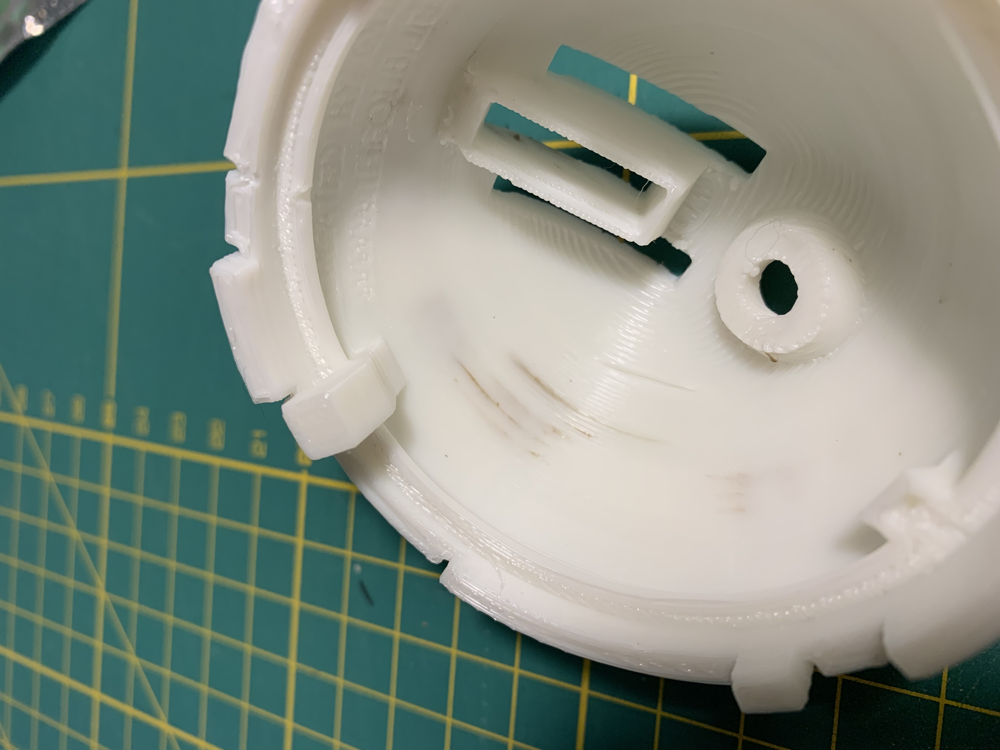

# Druckfehler 

## Braune Stellen im Filament

Braune Stellen im Druck können auf eine falsch verbaute Nozzle hindeuten. 

 { width: 100px; }

Des weitern kann es viele String mit verbranntem Filament geben, diese entstehen.

Des weiteren können auf dem Druckbett oder um den Drucker verbrannte Strings liegen.

### Ursache
Wenn zwischen Nozzle und Heatbreak ein kleiner Spalt bleibt, sammelt sich darin Filament, das verklebt und irgendwann im Druck landet. 

Die verbrannten Strings entstehen durch die Undichtigkeit. Filament wird langsam zwischen Heatbreak und Nozzle hindurchgedrückt und wandert das Gewinde außen entlang, bis es von der Kühlung aus dem Hotend herausgeblasen wird. 

### Lösung: Korrekte Installation der Nozzel

- Hotend auf 240 Grad aufheizen, dass möglichst viel Filament ausläuft. 
- Hotend auf 90 Grad abkühlen lassen und einen COld Pull ausführen um witere Reste aus der Nozzle zu entfernen. 
- Hotend im warmen Zustand demontieren
- Heatblock reinigen (abtupfen)
- Neue Nozzle eindrehen und festdrehen
- Der Heatbreak ist normal so installiert, dass zwischen Heatblock und Nozzle 0,5 - 1mm Platz bleibt. 
- Hotend auf 240 Grad aufheizen und Nozzle nochmals festziehen. 
- Im Aufgeheizten Zustand lässt sich die Nozzle nochmals 1/4 bis 1/2 Drehung fester drehen. Die Nozzle sollte nun bündig mit dem Heatbreak abschließen.
