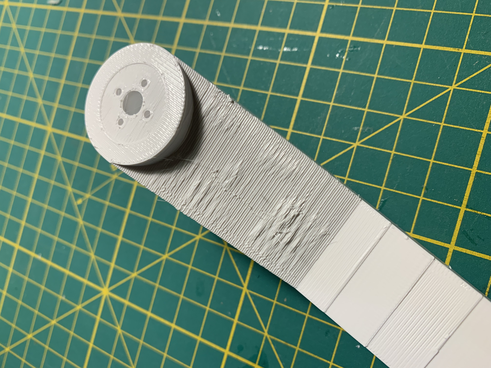

I tried various vendors for my projects. Here are some of my experiences.

# Anycubic 

Anycubic used to provide a very good standard PLA and PLA+ filament. No stringing, not sticky no layer lines, worked for very long bridges. It seemed to me the best standard PLA for a very good price. 

**2024 Anycubic changed their standard filament. It shows a lot of stringing and very sticky. After some testing, I came to following "sort-of-ok" settings.**

### Anycubic PLA (2024)

|Setting|Value| 
| --- | --- |
| Temp | 205°C |
| Flow Rate | 1.09 |
| Retraction Length | 0.7mm |
| Volumetric Speed | 12 |

**Printing Issues**

For unknown reasons, the filament caused a lot of pillowing.
While the flow rate test showed a flow rate of 1,05 the best result, with OrcaSlicers new YOLO test, I figured out, that 1,09 provided much better results - including pillowing disapearing. 

While the tests showed me to use 195°C for the nozzle temperature, printing results seemed to be quite bad in terms of stringing. Increasing the temerpature to 205°C almost removed the stringing.

# dasFilament PETG

|Setting|Value| 
| --- | --- |
| Temp | 220°C |
| Flow Rate | 1.04 |
| Retraction Length | 0.4mm |
| Volumetric Speed | TBA |

Print Speedn: 100 mm/s was not an issue for retrieving a very good print result 

# Sunlu PETG

|Setting|Value| 
| --- | --- |
| Temp | 230°C |
| Flow Rate | 1 |
| Retraction Length | TBA |
| Volumetric Speed | TBA |
| Print Speed | 80 mm/s |
| Ironing Speed | 15 mm/s |
| Ironing Flow | 30% |
| Ironing Line Spacing | 0.1 mm | 

Things to Test:
- Reduce ‘Support Speed’ and ‘Support Infill Speed’ which is usually half of your printing speed

### dasFilament

TBD

### Filament Unger

TBD

### Recycling Fabrik PETG

|Setting|Value| 
| --- | --- |
| Temp | 210°C |
| Flow Rate | 1.05 |
| Retraction Length | TBA |
| Volumetric Speed | TBA |
| Print Speed | 100 mm/s |
| Ironing Speed | 15 mm/s |
| Ironing Flow | TBA |
| Ironing Line Spacing | 0.1 mm | 

The best results for PETG was about 210°C. The least strings, no oozing. Best overhangs in the temp test.

Based on the YOLO test, we need a flow rate of 1.05.

### Sunlu 

