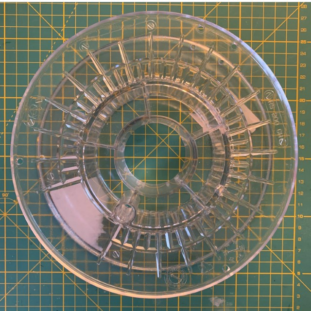
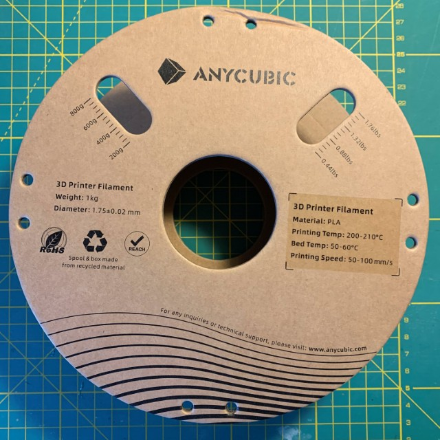
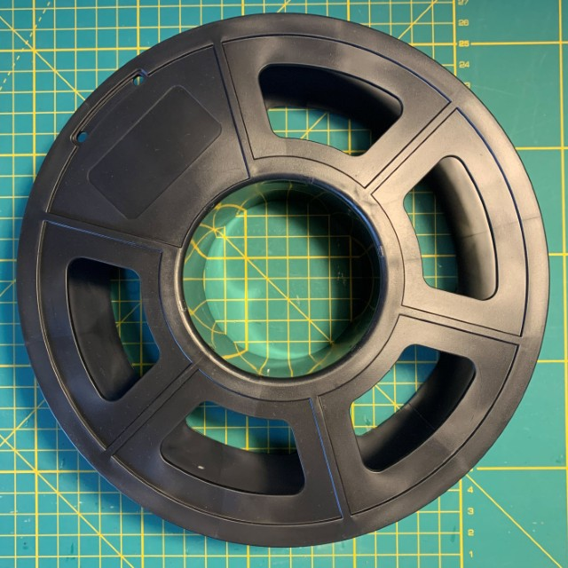
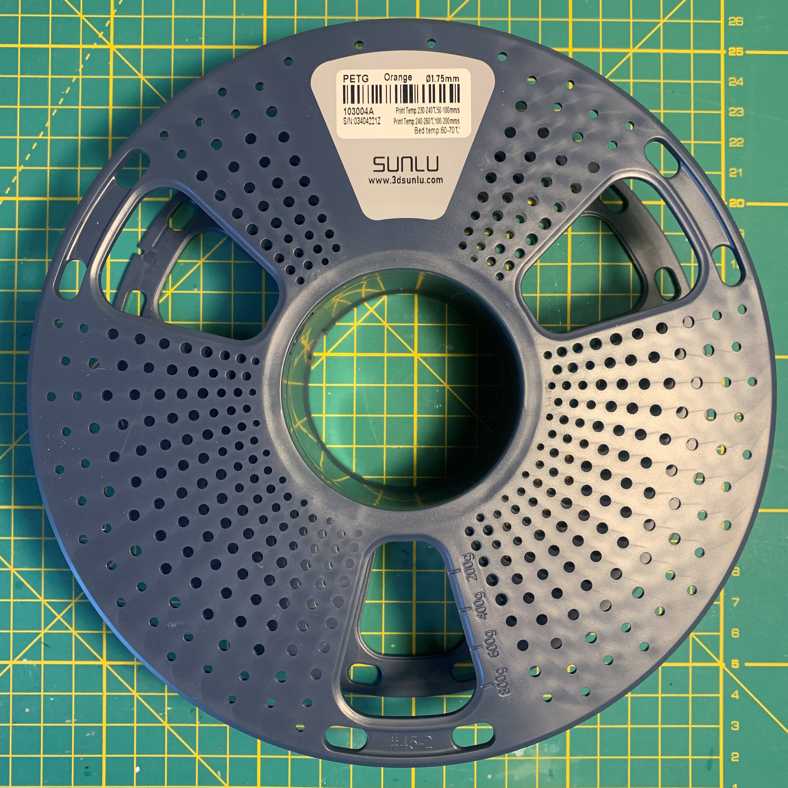

# Spools 

There are various databasaes out there, with information about spool capacity, weight and so on. 

In the following, I have listed the spool, I (frequently) have seen in my workshop. 

| Image | Details |
| --- | --- |
   | **Fillamentum**   Weight: 227g |
| | **Anycubic**   Cardboard   Weight: 135g |
| | **Anycubic**   Weight: 136g| 
| | **Sunlu**   Weight: 167g|
| | **Anycubic**   Weight: TBAg|  

Further databases: 

- [Empty Spool Weight Catalog](https://www.printables.com/model/464663-empty-spool-weight-catalog) at https://www.printables.com/

- [Database of filament spools info](https://www.onlyspoolz.com/portfolio/)
